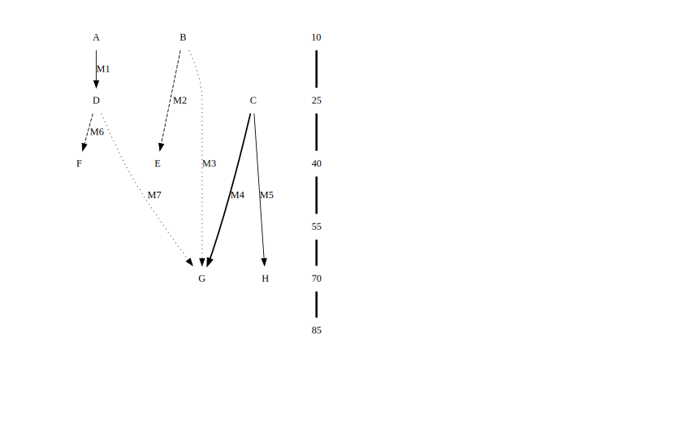

# Summary
In in Islam, Ḥadīth refers to a record of words, actions, or traditions of Muhammed and his companions. Hadiths typically consist of a text and a record about its transmission [@motzki2016hadith]. The corpus of  known Hadiths is also referred to as Hadith. The Hadith is an essential part of islamic tradition and offers moral guidance to many muslims around the world. How the Hadith originated in the formating years of Islam and its development throughout time is an active field of research and debate.

Islamic scholars model the transmission of Ḥadīth texts using isnād graphs. Nodes represent people transmitting texts and edges denote transmissions of texts between transmitters. An additional timeline is often provided, to put the nodes into historic context. Traditionally, scholars draw such graphs hand. As isnād graphs can become really large, this task can be very tedious. 

Here, we present the `isnalyser`, a simple set of tools to automate the drawing of isnād graphs. Moreover, our proposed application allows users to interactively inspect their data. We provide a `Python` package as well as a `Javascript`-based application, with the `isnalyserjs`.

# Statement of need

Tracing the roots of Ḥadīth texts is an active topic of debate. Isnād graphs provide a scientific approach to disentangling the web of possible transmissions. Moreover, resulting visualizations are a foundation for discourse. Drawing isnād trees by hand, however, is a laborious process. Especially for large networks, it can be tedious and prone to errors. Such Isnād trees are hard to replicate by other scholars.

Our approach deterministically renders an Isnad tree from data and thus decouples data from visualization. This allows other researchers to replicate Isnad trees from given data. It alleviates the risk of making errors in drawing the graph. Thus, the visualization becomes true to the data and potential errors can be traced more easily, as the graph is determined strictly by the data. 

Note that, the much more challenging process of collecting data is not automatized by the `isnalyser` and remain task of the scholar studying the hadīth texts . Only, the more tedious, and error prone task of visualizing the data is  handled by the proposed `isnalyser`.  The`isnalyser` can be used to enhance the data collecting process as possible errors can be spotted early when data is visualized in 'real-time'.

# The isnalyser(s)

In the following section, we will describe key concepts, features, and implementation details of the proposed `isnalyser`.

**Data structure** - Inspired by relational database design, we propose to store Isnad data in two tables: one defining *transmitters* (nodes) and one defining *transmissions* (edges). These tables are stored as csv files to make them accessible and human-readable. Rows in the *transmitters* file define nodes. Columns are *Name* (determines node label), *dAH* (denotes transmitter's death data and is used to determine graph layout), and *Origin* (denotes city of origin of a transmitter and is displayed in the info box). *Name* and *dAH* are mandatory.  Names serve as identifiers and are used to define transmissions. In the *transmissions* file, every row defines a transmission/edge between two transmitters. Mandatory columns thus are *From* and *To*. Further information can be given in the columns *FileName* (denotes text and determines edge label) and *TransmissionType* (determines edge style). An example of the two tables is shown in Table \autoref{tab:example}.

**Graph layout** - A timeline is created based on the range of death dates of *transmitters*. The step size of this timeline can be specified by the user to fit the data. We implement this timeline as an additional graph where each step is a separate node. These timeline nodes are used to for the layout of the actual isnad tree. They can be thought of as 'bins' of a histogram. According to each transmitters death data, the respective node is matched to the closest timeline step node. Further layout is handled by implementations  of Graphviz`[@gansner1993technique]`. Graphviz handles graphs described in the DOT language. The color of nodes is determined by the city of origin of a transmitter. Different edge styles encode different texts where the information is from. An example is shown in Figure \autoref{fig:example}.

**Python library** - We began development in Python as it offers great flexibility and an extensive ecosystem and developer community. Core functionality is distributed over different modules, which we will briefly describe here.

- `abbrevation` to ensure a clean graph layout, names of transmitters with more than $n$ characters are abbreviated. Only the first and last few characters are shown with $...$ in between.
- `colors` creates a color scheme based on the number of cities of origin, assigning each origin a unique color.
- `graph` serves as main module that parses the data and then uses the other modules to create an isnad graph. 
- `paths` merges redundant edges that will occur if transmissions overlap. 
- `ranking` creates a timeline as a subgraph. For each timeline node, it gives a list of nodes that fall into the 'bins' the timeline nodes form.

We published this version of the isnalyser as a `PyPI` [@pypi] package.

... continue from here...

**The interactive isnalyserjs** - The make the `isnalyser` accessible to users without coding knowledge, we developed a follow-up, interactive version. This version runs in the browser as a Javascript application. We use third party libraries d3 and graphvisjs(cite d3, graphvisjs)

- `index.html` defines the structure and interface of the application. This involves buttons and fields for the user to interact with as well as a canvas where the graph is renders and can be explored. It also handles imports of third party libraries.
- `app.js` contains the core functionality. It parses *transmitters* and *transmissions* file and uses the information to form a graph layout. Once the graph layout is determined, additional functions determine visual aspects of the graph. These include highlighting of edges, on hover as well as displaying additional information of transmitters, if a node is selected by the user.
- `style.css`  determines the colors and sizes of the interface elements.

# Example

|Transmitters|Transmissions|
|--|--|
|<table> <tr><th>Transmitter</th><th>dAH</th><th>Origin</th></tr><tr><td> A </td><td>10</td><td>I</td><tr><tr><td>B</td><td>23</td><td>J</td><tr><td>C</td><td>25</td><td>K</td><tr><td>D</td><td>35</td><td>I</td><tr><td>E</td><td>47</td><td>K</td><tr><td>F</td><td>50</td><td>K</td><tr><td>G</td><td>70</td><td>I</td><tr><td>H</td><td>72</td><td>J</td></tr> </table>| <table> <tr><th>From</th><th>To</th><th>FileName</th><th>TransmissionType</th></tr><tr><td>A</td><td>D</td><td>M1</td><td>0</td></tr><tr><td>B</td><td>E</td><td>M2</td><td>1</td></tr><tr><td>B</td><td>G</td><td>M3</td><td>2</td></tr><tr><td>C</td><td>G</td><td>M4</td><td>3</td></tr><tr><td>C</td><td>H</td><td>M5</td><td>0</td></tr><tr><td>D</td><td>F</td><td>M6</td><td>1</td></tr><tr><td>D</td><td>G</td><td>M7</td><td>2</td></tr></table>|

To illustrate the usage of the proposed isnalyser, we will run through an example here.

Transmitters|dAH|Origin
- | - |-
A|10|I
B|23|J
C|25|K
D|35|I
E|47|K
F|50|K
G|70|I
H|72|J

From|To|FileName|TransmissionType
-|-|-|-
A|D|M1|0
B|E|M2|1
B|G|M3|2
C|G|M4|3
C|H|M5|0
D|F|M6|1
D|G|M7|2

# Open ends

While being useful on its own already, our software further provides the base for a collaborative platform, where isnād trees can be shared and stored in a publicly accessible database. This could help make hadīth research more transparent and collaborative, a long standing challenge a commuinty of digital Islam science researchers strives to solve (cite digital hadith network). Further, the `isnalyser` could be become the 'front-end' of a data-collecting software and help to debug or verify such tools and eventually even become a fully automatic tool.

... The focus of our work is providing accessible data and making it reproducible

# Acknowledgements

# References

- `@author:2001`  ->  "Author et al. (2001)"
- `[@author:2001]` -> "(Author et al., 2001)"
- `[@author1:2001; @author2:2001]` -> "(Author1 et al., 2001; Author2 et al., 2002)"

# References